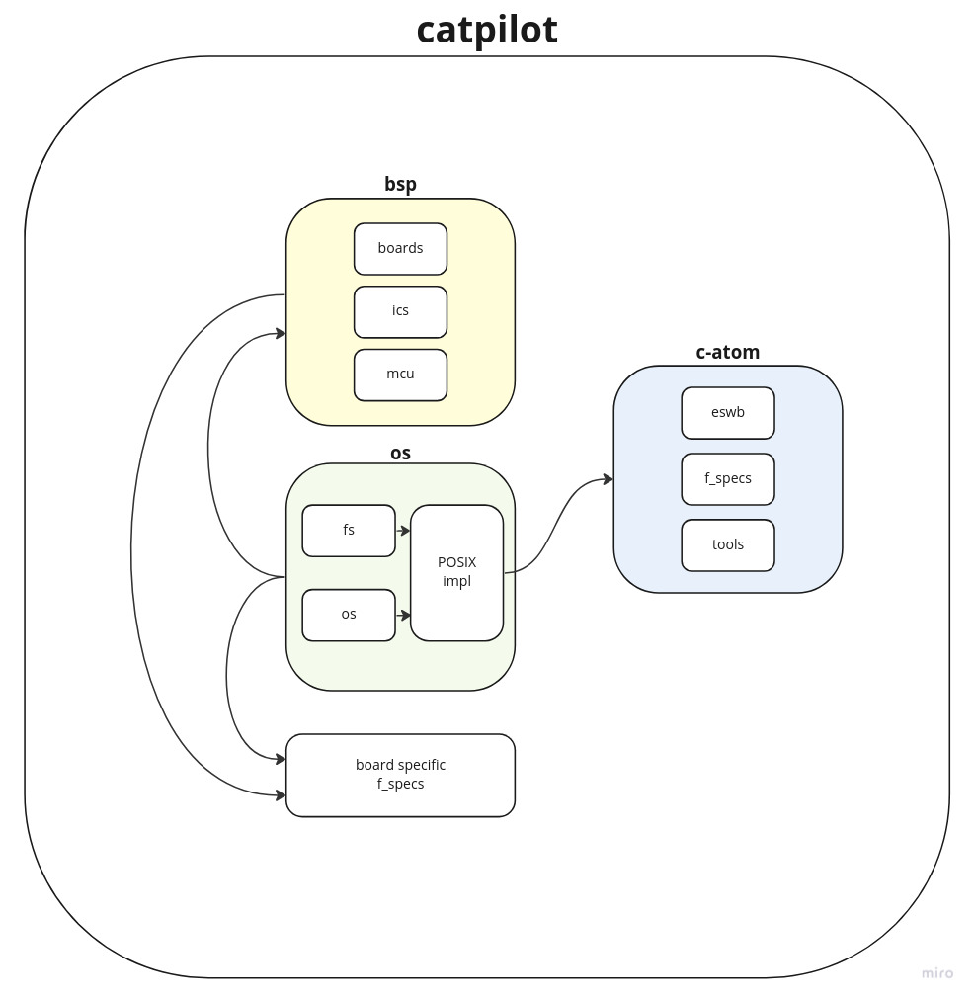

# Catpilot
Catpilot is an open-source library for drone autopilots. It is part of the generic project - [uas-catpilot](https://github.com/ctlst-tech/uas-catpilot). The core of this library is a platform-independent embedded framework - [c-atom](https://github.com/ctlst-tech/c-atom). Catpilot also provides board support packages and operating systems for various platforms and autopilots. This library should be connected as a submodule to the main project of the drone control system.

# Project structure
- bsp - drivers and high abstraction layer to work with a specific autopilot
- [c-atom](https://github.com/ctlst-tech/c-atom) - framework for embedded systems
- f_specs - description of common atomic functions
- os - operating systems and POSIX implementations

# What's next
Use the generic project for drone control systems with catpilot integration - [uas-catpilot](https://github.com/ctlst-tech/uas-catpilot). You can use uas-catpilot as a template for your control system, expand and customize it.
